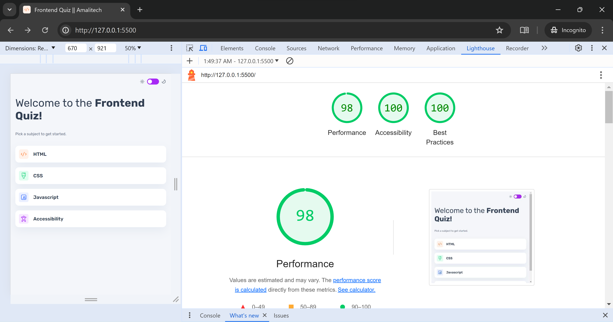

## Introduction

This is my submission for the Amalitech NSP training program. I have implemented all the UI components presented in the design file, along with their functionalities as described in the project scope.

## Links

- Live - https://frontend-amalitech.netlify.app/
- Github - https://github.com/Nakamcode/Frontend_Quiz_app

## Lighthouse Report

This is the Lighthouse report of the web application, focusing on accessibility, best practices, and performance.

## Challenges

- **State Management:** Managing the state was one of the challenges I faced while developing this application. I overcame it by breaking the state into micro and macro states.
- **Timing:** During the project period, I was also working on my final year project, which made multitasking difficult. Right after submitting my final year project, I had to prepare for exams. Once my exams were nearly over, I started working on this project.
- **Progress Bar:** Mozilla Firefox didn't offer me much support for styling the progress element compared to Chrome.

## Add-ons

Enhancements I added to the project to improve the user experience:

- **Accessibility:** I paid careful attention to accessibility throughout the design of the components. This ensured that the app can be fully navigated with the keyboard, making it more accessible.
- **Animation:** To enhance the user experience, I added animations to ensure seamless transitions between components.
- **Device Theme Preference:** I implemented theming based on the user's device preference, allowing users to maintain consistent theming across their devices.

## What I Learned

- **State Management:** The project enhanced my understanding of state management. It deepened my comprehension of the React lifecycle and hooks such as `useState`, `useEffect`, `useContext`, and other foundational React concepts.
- **Styled Components:** I had not used styled components for animation before, but this project gave me the opportunity to learn and implement animations. It was much easier than I initially thought.

## Conclusion

Thanks for the opportunity to participate in the program, happy coding!!
